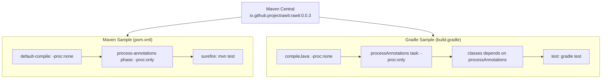

# Design Document — Sample Projects

## Overview

This feature adds a `samples/` directory at the repository root containing two self-contained sample projects that demonstrate how to consume the published Rawit annotation processor (`io.github.projectrawit:rawit:0.0.3`) from Maven Central. One project uses Maven, the other uses Gradle (Groovy DSL).

Both samples share the same application code — a small set of classes that exercise `@Invoker` (instance + static methods) and `@Constructor`, plus JUnit 5 tests that verify the generated fluent API works correctly. The only differences between the two samples are the build files and directory conventions.

### Goals

- Provide copy-paste-ready build configurations for both Maven and Gradle
- Demonstrate the two-pass compile setup required by Rawit
- Show all three annotation use cases: `@Invoker` on instance methods, `@Invoker` on static methods, `@Constructor` on constructors
- Include passing JUnit 5 tests that exercise the generated staged call chains
- Each sample is independently buildable from its own directory using only Maven Central

### Non-Goals

- The samples do not demonstrate overload groups or advanced features
- The samples do not use Gradle Kotlin DSL (Groovy DSL only)
- The samples are not part of the parent project's build

---

## Architecture

### Directory Layout

```
samples/
├── maven-sample/
│   ├── pom.xml
│   └── src/
│       ├── main/java/com/example/rawit/
│       │   ├── Calculator.java       # @Invoker on instance + static methods
│       │   └── Point.java            # @Constructor
│       └── test/java/com/example/rawit/
│           └── RawitSampleTest.java   # JUnit 5 tests for all three use cases
└── gradle-sample/
    ├── build.gradle
    ├── settings.gradle
    └── src/
        ├── main/java/com/example/rawit/
        │   ├── Calculator.java       # identical to Maven sample
        │   └── Point.java            # identical to Maven sample
        └── test/java/com/example/rawit/
            └── RawitSampleTest.java   # identical to Maven sample
```

Both samples use the package `com.example.rawit` and share identical Java source files. Only the build configuration differs.

### Build Configuration Strategy



### Key Design Decisions

1. **Shared source code** — Both samples use identical `Calculator.java`, `Point.java`, and `RawitSampleTest.java`. This keeps maintenance low and makes it easy to compare the two build systems side-by-side.
2. **Single test class** — One `RawitSampleTest.java` covers all three annotation use cases (instance `@Invoker`, static `@Invoker`, `@Constructor`). This keeps the sample minimal while still demonstrating everything.
3. **`com.example.rawit` package** — A conventional example package that clearly signals "this is sample code."
4. **`Calculator` for `@Invoker`** — A calculator class is a natural fit for demonstrating staged call chains on arithmetic methods. It provides both an instance method (`add(int x, int y)`) and a static method (`multiply(int a, int b)`).
5. **`Point` for `@Constructor`** — A 2D point is the canonical example for staged construction with named parameters.

---

## Components and Interfaces

### Calculator.java

Demonstrates `@Invoker` on both instance and static methods.

```java
package com.example.rawit;

import rawit.Invoker;

public class Calculator {

    @Invoker
    public int add(int x, int y) {
        return x + y;
    }

    @Invoker
    public static int multiply(int a, int b) {
        return a * b;
    }
}
```

After two-pass compilation, Rawit generates:
- `calculator.add()` → returns staged chain → `.x(3).y(4).invoke()` → `7`
- `Calculator.multiply()` → returns staged chain → `.a(3).b(4).invoke()` → `12`

### Point.java

Demonstrates `@Constructor`.

```java
package com.example.rawit;

import rawit.Constructor;

public class Point {

    private final int x;
    private final int y;

    @Constructor
    public Point(int x, int y) {
        this.x = x;
        this.y = y;
    }

    public int getX() { return x; }
    public int getY() { return y; }
}
```

After two-pass compilation, Rawit generates:
- `Point.constructor()` → returns staged chain → `.x(1).y(2).construct()` → `new Point(1, 2)`

### RawitSampleTest.java

JUnit 5 test class verifying all three generated APIs.

```java
package com.example.rawit;

import org.junit.jupiter.api.Test;
import static org.junit.jupiter.api.Assertions.*;

class RawitSampleTest {

    @Test
    void instanceInvoker() {
        Calculator calc = new Calculator();
        int result = calc.add().x(3).y(4).invoke();
        assertEquals(7, result);
    }

    @Test
    void staticInvoker() {
        int result = Calculator.multiply().a(3).b(4).invoke();
        assertEquals(12, result);
    }

    @Test
    void constructor() {
        Point p = Point.constructor().x(10).y(20).construct();
        assertEquals(10, p.getX());
        assertEquals(20, p.getY());
    }
}
```

### Maven pom.xml

Key configuration elements:
- Java 17 source/target via `maven-compiler-plugin`
- Rawit `0.0.3` as a compile dependency
- Two-pass compile: `default-compile` with `-proc:none`, `process-annotations` execution in `process-classes` phase with `-proc:only`
- JUnit 5 test dependency with `maven-surefire-plugin`

### Gradle build.gradle

Key configuration elements:
- `plugins { id 'java' }` with `sourceCompatibility = '17'`
- `mavenCentral()` repository
- Rawit `0.0.3` as both `annotationProcessor` and `compileOnly` dependency
- Two-pass compile: `compileJava` with `-proc:none`, `processAnnotations` task (type `JavaCompile`) with `-proc:only` depending on `compileJava`
- `classes.dependsOn processAnnotations`
- JUnit 5 test dependency with `useJUnitPlatform()`

### Gradle settings.gradle

Minimal settings file declaring the project name:
```groovy
rootProject.name = 'rawit-gradle-sample'
```

---

## Data Models

The sample projects do not introduce new data models beyond the two demonstration classes:

| Class | Fields | Purpose |
|---|---|---|
| `Calculator` | (none) | Stateless class demonstrating `@Invoker` on instance method `add(int x, int y)` and static method `multiply(int a, int b)` |
| `Point` | `int x`, `int y` (both `private final`) | Immutable value class demonstrating `@Constructor` on `Point(int x, int y)` |

### Build Dependency Graph

| Artifact | Scope (Maven) | Configuration (Gradle) | Version |
|---|---|---|---|
| `io.github.projectrawit:rawit` | `compile` | `annotationProcessor` + `compileOnly` | `0.0.3` |
| `org.junit.jupiter:junit-jupiter` | `test` | `testImplementation` | `5.11.4` |


---

## Correctness Properties

*A property is a characteristic or behavior that should hold true across all valid executions of a system — essentially, a formal statement about what the system should do. Properties serve as the bridge between human-readable specifications and machine-verifiable correctness guarantees.*

### Prework Summary

The sample-projects feature is primarily about creating specific files with specific content. Most acceptance criteria are verifiable as concrete examples (does this file exist? does it contain this string?) rather than universal properties. The compilation and runtime behavior criteria (3.3, 3.4, 4.3, 4.4, 5.3, 5.4, 8.1, 8.2) require actually running the build tools and are not amenable to unit/property testing — they are integration tests.

After analyzing all 30+ acceptance criteria, one genuine property emerges: both samples share identical Java source files, so for any shared source file, the Maven and Gradle copies must be byte-for-byte identical. All other testable criteria are examples.

### Property 1: Source file identity across samples

*For any* Java source file that exists in both `samples/maven-sample/src/` and `samples/gradle-sample/src/` at the same relative path, the file content should be byte-for-byte identical.

**Validates: Requirements 3.1, 3.2, 4.1, 4.2, 5.1, 5.2, 6.1–6.6, 7.1–7.6**

### Property 2: Maven pom.xml contains all required configuration elements

*For any* required configuration element in the set {rawit dependency coordinates, default-compile with -proc:none, process-annotations with -proc:only, Java 17 target, JUnit 5 test dependency}, the `samples/maven-sample/pom.xml` file should contain that element.

**Validates: Requirements 1.2, 1.3, 1.4, 1.5**

### Property 3: Gradle build.gradle contains all required configuration elements

*For any* required configuration element in the set {annotationProcessor rawit dependency, compileOnly rawit dependency, compileJava -proc:none, processAnnotations -proc:only, classes.dependsOn processAnnotations, Java 17 target, JUnit 5 test dependency, useJUnitPlatform()}, the `samples/gradle-sample/build.gradle` file should contain that element.

**Validates: Requirements 2.2, 2.3, 2.4, 2.5, 2.6**

---

## Error Handling

Since the sample projects are static file artifacts (not runtime code), error handling is minimal:

| Condition | Handling |
|---|---|
| Rawit `0.0.3` not available on Maven Central | Build fails with dependency resolution error — expected, as the artifact must be published first |
| Java version < 17 | Build fails with compiler error — pom.xml/build.gradle enforce Java 17 |
| Missing two-pass compile config | Annotation processing runs in wrong phase; generated overloads are silently skipped. The JUnit tests will fail to compile (methods like `add()`, `constructor()` won't exist) |
| Gradle wrapper not present | User must have Gradle installed locally or add the wrapper. The sample does not include a Gradle wrapper to keep it minimal |

The test class (`RawitSampleTest.java`) uses standard JUnit 5 assertions. Test failures produce clear messages indicating which staged call chain produced an unexpected result.

---

## Testing Strategy

### Dual Testing Approach

- **Unit tests** (JUnit 5): Verify specific examples — file existence, file content, build configuration correctness
- **Property tests** (jqwik): Verify the universal property that shared source files are identical across both samples

Both are complementary: unit tests catch concrete content issues, the property test ensures the two samples stay in sync.

### Property-Based Testing Library

Use **jqwik** (already used in the parent project) for property tests. Each property test runs a minimum of **100 iterations** where applicable. For file-identity checks, the iteration count equals the number of shared source files.

Each property test is tagged with a comment in the format:
`// Feature: sample-projects, Property N: <property text>`

### Unit Test Coverage

Unit tests verify the example-based acceptance criteria:

- **Build file existence**: `samples/maven-sample/pom.xml` and `samples/gradle-sample/build.gradle` exist
- **Maven pom.xml content**: Contains rawit `0.0.3` dependency, two-pass compiler plugin config, Java 17 target, JUnit 5 dependency, no parent POM
- **Gradle build.gradle content**: Contains `mavenCentral()`, rawit `0.0.3` as `annotationProcessor` + `compileOnly`, two-pass compile tasks, `classes.dependsOn processAnnotations`, Java 17 target, JUnit 5 dependency, `useJUnitPlatform()`
- **Source file content**: `Calculator.java` has `@Invoker` on instance method with ≥2 params, `@Invoker` on static method with ≥2 params; `Point.java` has `@Constructor` on constructor with ≥2 params
- **Test file content**: `RawitSampleTest.java` contains test methods exercising instance invoker, static invoker, and constructor staged call chains
- **Self-containment**: Maven sample has no parent POM reference; Gradle sample declares `mavenCentral()` repository

### Property Test Coverage

| Property | Test |
|---|---|
| Property 1: Source file identity | For each `.java` file under `samples/maven-sample/src/`, verify the corresponding file under `samples/gradle-sample/src/` has identical content |
| Property 2: Maven config completeness | For each required config element, verify it appears in `pom.xml` |
| Property 3: Gradle config completeness | For each required config element, verify it appears in `build.gradle` |

### Integration Testing (Manual)

The following are verified manually (or in CI) by actually running the builds:

- `cd samples/maven-sample && mvn clean test` passes
- `cd samples/gradle-sample && gradle clean test` passes

These are not automated as unit/property tests because they require Maven/Gradle tooling and network access to Maven Central.
